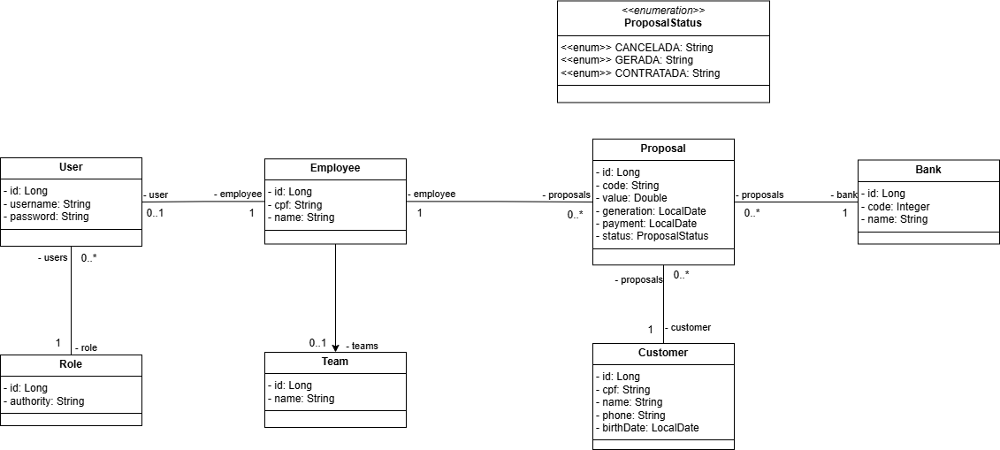

# Projeto Spring Corban Multibancos
Um sistema para gestão de carteira de clientes, negociações e acompanhamento de resultados. Este projeto possui implementação apenas no backend usando Spring Boot para criação de API REST.

## Contextualização do problema
A empresa Corban Multibancos atua como correspondente bancário na oferta de empréstimos de diversos bancos, oferecendo tanto empréstimos novos quanto renovações de empréstimos. Os funcionários precisam armazenar diariamente dados das negociações e dos clientes a fim de ter uma lista de contatos, histórico de negociações e permitir que os supervisores acompanhem o resultado diário dos consultores.

A estratégia de armazenamento de dados adotada pela empresa foi a de planilhas eletrônicas por serem fáceis de usar. Os supervisores possuem planilhas de dados gerais de toda a empresa e os consultores possuem planilhas de suas próprias negociações e clientes, cada um com sua própria organização. A cada nova negociação, os consultores precisam repassar os dados para os supervisores incluírem nas planilhas gerais. Periodicamente, os supervisores precisam verificar a consistência das planilhas dos consultores e acabam tendo o trabalho dificultado devido à falta de padronização de dados e, consequentemente, gastam muito tempo nessa tarefa.

## Solução proposta
A falta de padronização de dados, a quantidade de trabalho manual e retrabalho acabam dificultando a geração de uma base de dados útil para a empresa. Uma forma de solucionar esses problemas é a construção de um sistema com banco de dados para ser utilizado por todos os funcionários. O sistema deve ter diferentes níveis de acesso para cada funcionário, padronização e validação de dados de modo que o retrabalho no repasse de dados entre consultores e supervisores seja eliminado, a consistência dos dados seja melhorada e cada consultor tenha acesso somente a seus dados enquanto a supervisão tenha acesso geral.

A expectativa com o uso do sistema é a geração de uma base de dados mais sólida e redução do esforço na gestão dos dados, permitindo melhores acompanhamentos de resultados e análises de negócios.

## Diagrama de caso de uso
 

O gestor é encarregado de gerenciar os cadastros de equipes, bancos, funcionários e usuários do sistema, e gerar relatório de resultado diário. Ele pode também gerenciar o cadastro de clientes e propostas. O gestor possui acesso irrestrito a qualquer funcionalidade do sistema.

O consultor é responsável pelas negociações com clientes, podendo gerenciar os cadastros de clientes e propostas com algumas restrições de funcionalidade.

Para facilitar o uso do sistema, é disponibilizado o cadastro de clientes na mesma tela do cadastro de propostas. Caso o cliente já tenha cadastro, os campos do formulário de cliente são preenchidos automaticamente; caso contrário, é necessário preencher manualmente os dados do cliente.

Ambos os usuários podem exportar os resultados de buscas para arquivo de extensão .csv, que possibilita a importação de dados em outros aplicativos especializados em análise de dados. O relatório é um conjunto de tabelas e subtabelas com campos total e subtotal, e inicialmente não pode ser exportado.

## Diagrama de classes

Cada proposta deve obrigatoriamente ter um funcionário responsável por sua elaboração, um cliente destinatário e um banco que realizará o empréstimo. Os funcionários podem atuar individualmente ou em equipe, sendo possível que existam equipes sem funcionários atribuídos. Bancos, clientes e funcionários podem ser cadastrados no sistema sem a necessidade de vínculo imediato com uma proposta.

## Requisitos de software
Os requisitos funcionais do sistema podem ser encontrados no <a href="./documents/requisitos de software.docx">documento de requisitos</a>.

## Tecnologias utilizadas
- Java
- Spring Boot
- Spring Data JPA

